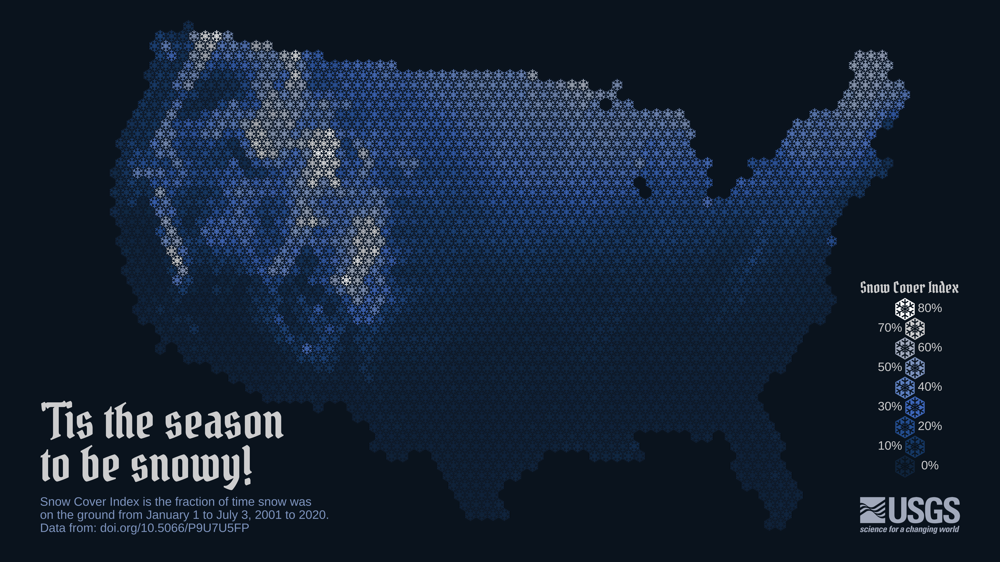

# 432 Class 03: 2023-01-24

[Main Website](https://thomaselove.github.io/432-2023/) | [Calendar](https://thomaselove.github.io/432-2023/calendar.html) | [Syllabus](https://thomaselove.github.io/432-syllabus-2023/) | [Notes](https://thomaselove.github.io/432-notes/) | [Contact Us](https://thomaselove.github.io/432-2023/contact.html) | [Canvas](https://canvas.case.edu) | [Data and Code](https://github.com/THOMASELOVE/432-data) | [Sources](https://github.com/THOMASELOVE/432-classes-2023/tree/main/sources)
:-----------: | :--------------: | :----------: | :---------: | :-------------: | :-----------: | :------------: |:------:
for everything | for deadlines | expectations | from Dr. Love | ways to get help | lab submission | for downloads | to read

## Today's Slides

Class | Date | PDF | Quarto .qmd | Recording
:---: | :--------: | :------: | :------: | :-------------:
03 | 2023-01-24 | **[Slides 03](https://github.com/THOMASELOVE/432-slides-2023/blob/main/slides03.pdf)** | **[Code 03](https://github.com/THOMASELOVE/432-slides-2023/blob/main/slides03.qmd)** | Visit [Canvas](https://canvas.case.edu/), select **Zoom** and **Cloud Recordings**

- The PDF link provides the version of the slides that I suggest you focus on during class.
- The Quarto file link provides the code I used (in [Quarto](https://quarto.org/)) to build the slides.
- See [the resources page](https://github.com/THOMASELOVE/432-classes-2023/tree/main/sources#learning-about-quarto-and-making-the-switch-from-r-markdown) for more advice on using Quarto and transitioning to Quarto from R Markdown. 

## Announcements
 
To come.

## Additional Resources on Survey Weights

The `survey` package home page: http://r-survey.r-forge.r-project.org/survey/index.html

### Tutorials...

- https://www.r-bloggers.com/2015/09/linear-models-with-weighted-observations/
- https://stackoverflow.com/questions/10268689/weighted-regression-in-r
- https://online.stat.psu.edu/stat501/lesson/r-help-13-weighted-least-squares

### On NHANES specifically...

- https://wwwn.cdc.gov/nchs/nhanes/analyticguidelines.aspx
- https://wwwn.cdc.gov/nchs/nhanes/tutorials/Module3.aspx
- https://stylizeddata.com/how-to-use-survey-weights-in-r/
- https://stats.idre.ucla.edu/r/faq/how-can-i-do-regression-estimation-with-survey-data/
- http://asdfree.com/national-health-and-nutrition-examination-survey-nhanes.html

## What Should I Be Working On?

To come.

## One Last Thing

[Origin and development of a Snowflake Map](https://waterdata.usgs.gov/blog/snow-tiles-demo/) by Althea Archer (posted 2023-01-11) provides reproducible R code demonstrating the evolution of a recent data visualization of snow cover in the continental United States. This work is a product of the USGS (United States Geological Survey) - the nation's largest water, earth and biological science and civilian mapping agency.

I learned about this work from [this post at FlowingData](https://flowingdata.com/2023/01/17/snow-cover-mapped-using-snowflakes/).

## Shameless Promotion: The Play That Goes Wrong 

- The Play That Goes Wrong runs from January 27 - February 18, 2023 on Friday and Saturday nights at 8 PM at [Aurora Community Theatre](https://www.auroracommunitytheatre.com/).
- Details at https://github.com/THOMASELOVE/theater and https://www.auroracommunitytheatre.com/
- Tickets are going quite quickly. It is plausible that some or even many performances will sell out in advance, so if you want to go, please buy tickets soon.
- Thank you.
