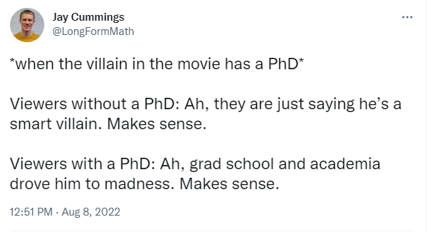
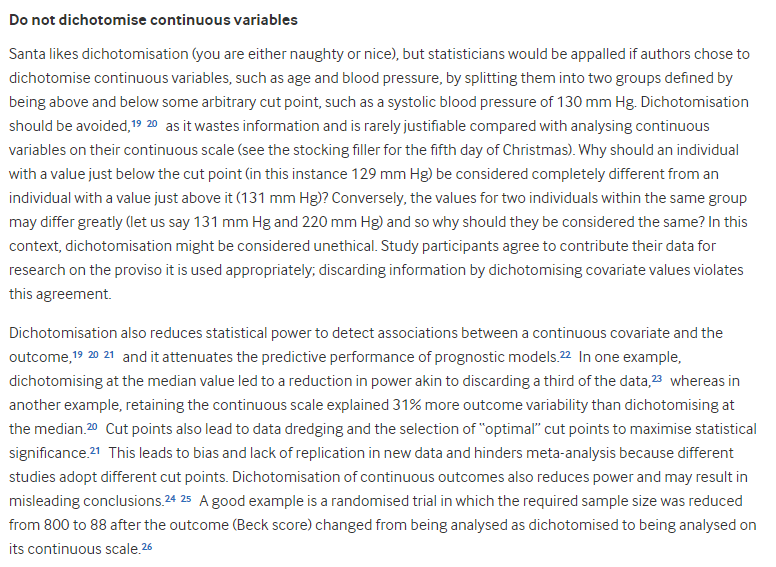

# 432 Class 04: 2023-01-26

[Main Website](https://thomaselove.github.io/432-2023/) | [Calendar](https://thomaselove.github.io/432-2023/calendar.html) | [Syllabus](https://thomaselove.github.io/432-syllabus-2023/) | [Notes](https://thomaselove.github.io/432-notes/) | [Contact Us](https://thomaselove.github.io/432-2023/contact.html) | [Canvas](https://canvas.case.edu) | [Data and Code](https://github.com/THOMASELOVE/432-data) | [Sources](https://github.com/THOMASELOVE/432-classes-2023/tree/main/sources)
:-----------: | :--------------: | :----------: | :---------: | :-------------: | :-----------: | :------------: |:------:
for everything | for deadlines | expectations | from Dr. Love | ways to get help | lab submission | for downloads | to read

## Today's Slides

Class | Date | PDF | Quarto .qmd | Recording
:---: | :--------: | :------: | :------: | :-------------:
04 | 2023-01-26 | **[Slides 04](https://github.com/THOMASELOVE/432-slides-2023/blob/main/slides04.pdf)** | **[Code 04](https://github.com/THOMASELOVE/432-slides-2023/blob/main/slides04.qmd)** | Visit [Canvas](https://canvas.case.edu/), select **Zoom** and **Cloud Recordings**

- The PDF link provides the version of the slides that I suggest you focus on during class.
- The Quarto file link provides the code I used (in [Quarto](https://quarto.org/)) to build the slides.
- See [the resources page](https://github.com/THOMASELOVE/432-classes-2023/tree/main/sources#learning-about-quarto-and-making-the-switch-from-r-markdown) for more advice on using Quarto and transitioning to Quarto from R Markdown. 

## From [On the 12th Day of Christmas, a Statistician Sent to Me...](https://www.bmj.com/content/379/bmj-2022-072883)

> To elicit the most common issues encountered during statistical peer review, an internal survey was administered to The BMJ’s statistical editors. Twelve items were identified, and each are described here. There is one item for each of the 12 days of Christmas, the period between 25 December and 5 January when the statisticians conduct their reviews in the mindset of the Grinch, but with the kind heart of *Miracle On 34th Street*.

## Announcements
 
1. The data set we'll discuss today (`class4im.Rds`) is available on [our 432-data site](https://github.com/THOMASELOVE/432-data).
2. Feedback on the **Minute Paper after Class 03** will be available **by class time**.
3. [The Play That Goes Wrong at Aurora Community Theatre](https://www.auroracommunitytheatre.com/) starts its run tomorrow (Friday) night and continues through 2023-02-18. Thanks for putting up with these reminders. Come, if you like.

## About Lab 1

1. Lab 1 Grades will be posted to our Shared Drive by Tuesday morning 2023-01-31. You'll need a Lab Code to access your grades on the Shared Drive, and Dr. Love will send those out by the end of the day on Monday 2023-01-30, via email.
2. The following students used versions of R earlier than 4.2.2 in Lab 1, and should [upgrade to R 4.2.2](https://thomaselove.github.io/432-2023/software.html) in time for Lab 2 and the rest of the course: **Naji Ayyash, Samantha Baker, Lithe Basbous, Joshua Freeze, Tracy Kongai, Tian Liu, Sameer Prasada, Miza Salim Hammoud, Faruk Senturk, Neha Solanki, Max Tjen** and **Fang Wang**. In addition, **Sriram Satyavolu** may need to upgrade but we cannot tell.

## What Should I Be Working On?

1. [Lab 2](https://thomaselove.github.io/432-2023/lab2.html) due Monday 2023-01-30 at 9 PM.
2. Continue reading [How To Be A Modern Scientist](https://leanpub.com/modernscientist) (so you're done by next Thursday's class.)

## One Last Thing

Looking for R resources? You might want to bookmark [The Big Book of R](https://www.bigbookofr.com/index.html#your-last-ever-bookmark) which is a collection of links to more than 200 books about R.
