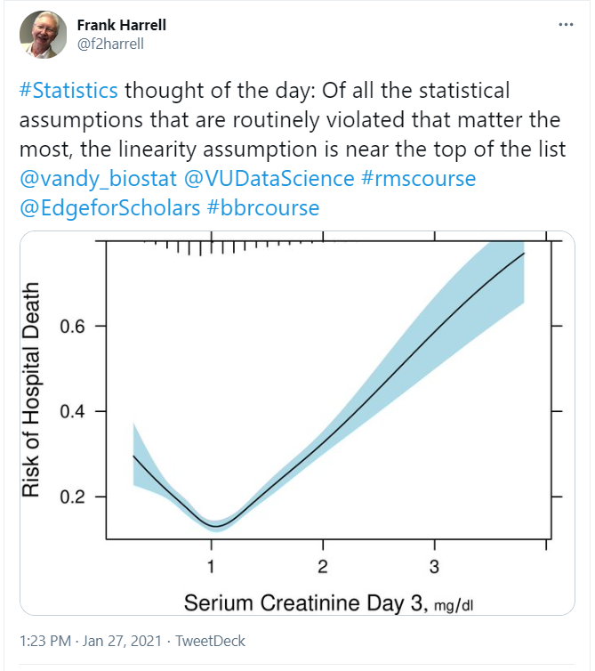

# 432 Class 05: 2023-01-31

[Main Website](https://thomaselove.github.io/432-2023/) | [Calendar](https://thomaselove.github.io/432-2023/calendar.html) | [Syllabus](https://thomaselove.github.io/432-syllabus-2023/) | [Notes](https://thomaselove.github.io/432-notes/) | [Contact Us](https://thomaselove.github.io/432-2023/contact.html) | [Canvas](https://canvas.case.edu) | [Data and Code](https://github.com/THOMASELOVE/432-data) | [Sources](https://github.com/THOMASELOVE/432-classes-2023/tree/main/sources)
:-----------: | :--------------: | :----------: | :---------: | :-------------: | :-----------: | :------------: |:------:
for everything | for deadlines | expectations | from Dr. Love | ways to get help | lab submission | for downloads | to read

## Today's Slides

Class | Date | PDF | Quarto .qmd | Recording
:---: | :--------: | :------: | :------: | :-------------:
05 | 2023-01-31 | **[Slides 05](https://github.com/THOMASELOVE/432-slides-2023/blob/main/slides05.pdf)** | **[Code 05](https://github.com/THOMASELOVE/432-slides-2023/blob/main/slides05.qmd)** | Visit [Canvas](https://canvas.case.edu/), select **Zoom** and **Cloud Recordings**

- The PDF link provides the version of the slides that I suggest you focus on during class.
- The Quarto file link provides the code I used (in [Quarto](https://quarto.org/)) to build the slides.
- See [the resources page](https://github.com/THOMASELOVE/432-classes-2023/tree/main/sources#learning-about-quarto-and-making-the-switch-from-r-markdown) for more advice on using Quarto and transitioning to Quarto from R Markdown. 

## Announcements
 
1. I updated Lab 3's instructions and Chapter 10 in the Course Notes to fix typos.
2. **To Come**: I will add a note about endorsing useful responses on Campuswire. Reminder about one account to a person on Campuswire.
3. Last night (2023-01-30) you should have received an email from me with the subject line: **432 Lab Code from Professor Love (please save this email)**. That email provides the three-digit Lab Code you will need to identify the feedback and grades for your work on the **Grading Roster for 432 Spring 2023** found on our *Shared Google Drive*. Here you will find detailed feedback and grades for all Labs (so far, just Lab 1, of course), and the grades for your Minute Papers (so far, just the Minute Paper after Class 03).
    - **To Come** Comments on Lab 1 results.
4. **To Come** Minute Paper after Class 05.

## Learning More About the Harrell-Verse

In classes 05-06, we'll start to focus on a set of techniques from the `rms` and `Hmisc` packages for fitting and evaluating linear regression models developed by Frank Harrell at Vanderbilt, with his colleagues. As supplemental reading, I can strongly recommend:

- [An Introduction to the Harrell"verse": Predictive Modeling using the Hmisc and rms Packages](https://www.nicholas-ollberding.com/post/an-introduction-to-the-harrell-verse-predictive-modeling-using-the-hmisc-and-rms-packages/) by Nicholas Ollberding
- Frank Harrell's [Biostatistics for Biomedical Research (BBR) Course on YouTube](https://www.youtube.com/channel/UC-o_ZZ0tuFUYn8e8rf-QURA/videos) includes a series of lectures on many of the topics we'll be discussing in 432, in addition to several late-breaking items. Details on the course are available [here](https://hbiostat.org/bbr/) and the notes are linked below.
- Frank E. Harrell and Chris Slaughter [Biostatistics for Biomedical Research Notes](http://hbiostat.org/doc/bbr.pdf) (pdf) - also see the YouTube course above.
- Frank E. Harrell [Regression Modeling Strategies](https://github.com/THOMASELOVE/432-classes-2023/blob/main/sources/pdf/Harrell_Regression_Modeling_Strategies_2015_2e_protected.pdf), 2nd Edition, 2015.
- [datamethods](https://discourse.datamethods.org/) "is a place where statisticians, epidemiologists, informaticists, machine learning practitioners, and other research methodologists communicate with themselves and with clinical, translational, and health services researchers to discuss issues related to data: research methods, quantitative methods, study design, measurement, statistical analysis, interpretation of data and statistical results, clinical trials, journal articles, statistical graphics, causal inference, medical decision making, and more." This resource's [rationale is here](http://fharrell.com/post/disc), and Frank spends meaningful time responding to questions on that board, so when our course ends, you might consider looking there for some suggestions.

## What Should I Be Working On?

To come.

## One Last Thing

To come.
