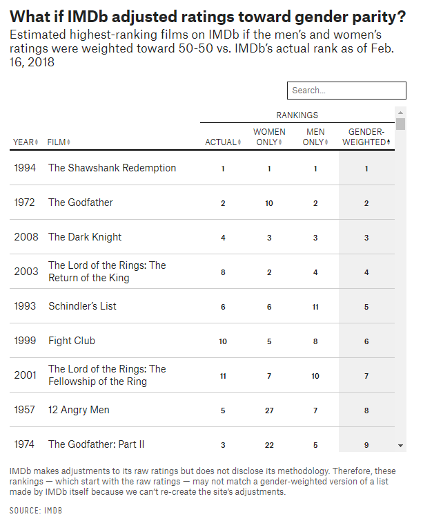

# 432 Class 08: 2023-02-09

[Main Website](https://thomaselove.github.io/432-2023/) | [Calendar](https://thomaselove.github.io/432-2023/calendar.html) | [Syllabus](https://thomaselove.github.io/432-syllabus-2023/) | [Notes](https://thomaselove.github.io/432-notes/) | [Contact Us](https://thomaselove.github.io/432-2023/contact.html) | [Canvas](https://canvas.case.edu) | [Data and Code](https://github.com/THOMASELOVE/432-data) | [Sources](https://github.com/THOMASELOVE/432-classes-2023/tree/main/sources)
:-----------: | :--------------: | :----------: | :---------: | :-------------: | :-----------: | :------------: |:------:
for everything | for deadlines | expectations | from Dr. Love | ways to get help | lab submission | for downloads | to read

## Today's Slides

Class | Date | PDF | Quarto .qmd | Recording
:---: | :--------: | :------: | :------: | :-------------:
08 | 2023-02-09 | **[Slides 08](https://github.com/THOMASELOVE/432-slides-2023/blob/main/slides08.pdf)** | **[Code 08](https://github.com/THOMASELOVE/432-slides-2023/blob/main/slides08.qmd)** | Visit [Canvas](https://canvas.case.edu/), select **Zoom** and **Cloud Recordings**

## Announcements

1. We will post feedback to the Minute Paper After Class 07 **before class time**.

## What should I be working on?

1. [Project A Plan](https://thomaselove.github.io/432-2023/projA.html) due Monday 2023-02-13 at 9 PM. See the [Class 07 README](https://github.com/THOMASELOVE/432-classes-2023/tree/main/class07) for lots of reminders.
2. If you haven't already done so, leave a comment on the Campuswire post about How To Be a Modern Scientist.

## Sources Related to Today's Data

- The [Bechdel Test Movie List](https://bechdeltest.com/)
- The [Internet Movie Data Base](https://www.imdb.com/)
- Link for the Google Sheet I'll Use Today [is here](https://docs.google.com/spreadsheets/d/1ZGbMGxc23pAhBuCDLw_-Xe-6ZlhkaEg6L8HzXxmZgxo/edit?usp=sharing)
- The googlesheets4 package is described in detail at its home page: <https://googlesheets4.tidyverse.org/>
- Walt Hickey, 538, [The Dollar-And-Cents Case Against Hollywood's Exclusion of Women](https://fivethirtyeight.com/features/the-dollar-and-cents-case-against-hollywoods-exclusion-of-women/), posted 2014-04-01.

## The Play That Goes Wrong

A few tickets are still available for our last four performances: February 10, 11, 17 and 18 at 8 PM, at https://www.auroracommunitytheatre.com/. If you cannot get a seat in the Center, then House Left (seats begin with the number 1, rather than 3) is probably a better choice than House Right. 

## One Last Thing

Walt Hickey, 538, [What If Online Movie Ratings Weren't Based Almost Entirely On What Men Think?](https://fivethirtyeight.com/features/what-if-online-movie-ratings-werent-based-almost-entirely-on-what-men-think/), posted 2018-03-06, which is the source for the two images below...

