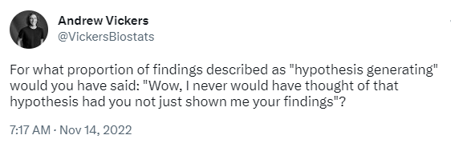
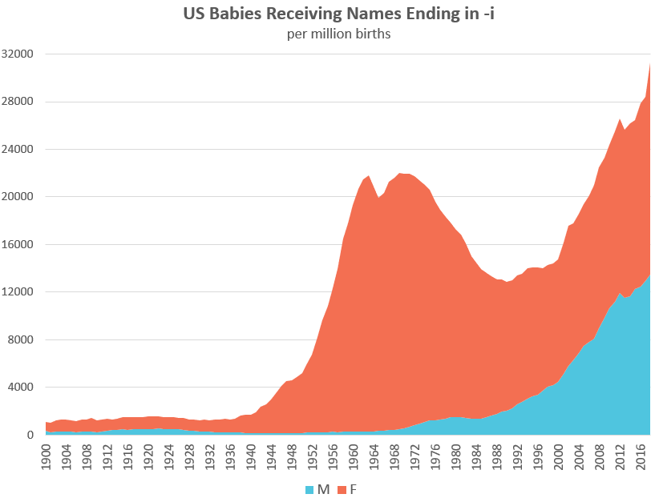

# 432 Class 09: 2023-02-14

[Main Website](https://thomaselove.github.io/432-2023/) | [Calendar](https://thomaselove.github.io/432-2023/calendar.html) | [Syllabus](https://thomaselove.github.io/432-syllabus-2023/) | [Notes](https://thomaselove.github.io/432-notes/) | [Contact Us](https://thomaselove.github.io/432-2023/contact.html) | [Canvas](https://canvas.case.edu) | [Data and Code](https://github.com/THOMASELOVE/432-data) | [Sources](https://github.com/THOMASELOVE/432-classes-2023/tree/main/sources)
:-----------: | :--------------: | :----------: | :---------: | :-------------: | :-----------: | :------------: |:------:
for everything | for deadlines | expectations | from Dr. Love | ways to get help | lab submission | for downloads | to read

## Today's Slides

Class | Date | PDF | Quarto .qmd | Recording
:---: | :--------: | :------: | :------: | :-------------:
09 | 2023-02-14 | **[Slides 09](https://github.com/THOMASELOVE/432-slides-2023/blob/main/slides09.pdf)** | **[Code 09](https://github.com/THOMASELOVE/432-slides-2023/blob/main/slides09.qmd)** | Visit [Canvas](https://canvas.case.edu/), select **Zoom** and **Cloud Recordings**

 [link to tweet](https://twitter.com/vickersbiostats/status/1592129524426485760)

## Announcements / Updates since last class

1. I updated [the Syllabus](https://thomaselove.github.io/432-syllabus-2023/) to point to [Contact Us](https://thomaselove.github.io/432-2023/contact.html) as the place containing our Campuswire information.
2. I updated the first sentence of Section 21.5 of [the Course Notes](https://thomaselove.github.io/432-notes/) to fix a misspelling.
3. I updated the Course Grading Roster on our Shared Drive to include feedback and grades on [Lab 3](https://thomaselove.github.io/432-2023/lab3.html).
4. I updated [the Quiz 1 page](https://thomaselove.github.io/432-2023/quiz1.html) to include a link to a [PDF of the (draft) instructions for Quiz 1](https://github.com/THOMASELOVE/432-classes-2023/blob/main/quiz1/instructions_only_draft.pdf). 
    - You'll get Quiz 1, including revised instructions, by 5 PM on 2023-02-23. Quiz 1 is due Monday 2023-02-27 at 9 PM.

## What Should I Be Working On?

1. If you haven't already, please contribute (by 2023-02-17) to Campuswire by adding your comments to the note: How To Be A Modern Scientist: Discussion 1.
2. There is a [Minute Paper after Class 09](https://bit.ly/432-2023-minute-09), due Wednesday 2023-02-15 at noon.
3. [Lab 4](https://thomaselove.github.io/432-2023/lab4.html) is due Monday 2023-02-20 at 9 PM to Canvas.
4. If all of your [Project A plan materials](https://thomaselove.github.io/432-2023/projA.html) are in on time, you will receive feedback from us before class time Thursday. 
    - Details on the [submissions we've received are found here](https://github.com/THOMASELOVE/432-classes-2023/blob/main/projectA/plans.md).
    - We want to be sure all Project A Plans are approved well before 2023-03-01 at noon.

## On (Project) Titles

- Your project should have a meaningful title (not containing the words “432” or “Project” or “Proposal” or “Plan”) but rather something describing your actual data and plans.
- Please keep the main title to no more than 80 characters, including spaces.
- Avoid deadwood like "The Analysis of" or "Analyzing" or "Effects of" or "factors associated with" in titles.
- Don't use acronyms, initialisms or abbreviations in titles which confuse the reader. 

Your readers for assignments in 432 include: other students in this class, the TAs, and Dr. Love.

## Today's Data

comes from [NHANES, specifically the 2011-12 administration](https://wwwn.cdc.gov/nchs/nhanes/continuousnhanes/overview.aspx?BeginYear=2011).

## A Resource that might help you

[Journal Articles with Quarto](https://quarto.org/docs/journals/)

## One Last Thing

[Labeling the x and y axes: Here’s a quick example where a bit of care can make a big difference](https://statmodeling.stat.columbia.edu/2023/01/26/labeling-the-x-and-y-axes-heres-a-quick-example-where-a-bit-of-care-can-make-a-big-difference/) by Andrew Gelman

- The post is made in reference to [this article at Namerology from Laura Wattenberg](https://namerology.com/2020/08/20/the-three-ages-of-i-names-an-american-tale/) and the graph shown below, and is meant to show that even a generally good graph (like this one) can be improved with some attention to details.

## One Additional Last Thing

Something like 219 million people have been born on [St. Valentine's Day](https://en.wikipedia.org/wiki/Valentine%27s_Day), February 14, including...

- [Anna Howard Shaw](https://en.wikipedia.org/wiki/Anna_Howard_Shaw), [Jimmy Hoffa](https://en.wikipedia.org/wiki/Jimmy_Hoffa), [Michael Bloomberg](https://en.wikipedia.org/wiki/Michael_Bloomberg), 
[Teller](https://en.wikipedia.org/wiki/Teller_(magician)), [Frederick Douglass](https://en.wikipedia.org/wiki/Frederick_Douglass), [Noriko Sakai](https://en.wikipedia.org/wiki/Noriko_Sakai)
- [Kris Aquino](https://en.wikipedia.org/wiki/Kris_Aquino), [Terry Gross](https://en.wikipedia.org/wiki/Terry_Gross), [Mark Rutte](https://en.wikipedia.org/wiki/Mark_Rutte), [Rob Thomas](https://en.wikipedia.org/wiki/Rob_Thomas_(musician)), [Ken Levine](https://en.wikipedia.org/wiki/Ken_Levine_(screenwriter)), [Renée Fleming](https://en.wikipedia.org/wiki/Ren%C3%A9e_Fleming)
- [Carl Bernstein](https://en.wikipedia.org/wiki/Carl_Bernstein), [Eugene Fama](https://en.wikipedia.org/wiki/Eugene_Fama), [Edinson Cavani](https://en.wikipedia.org/wiki/Edinson_Cavani), [Ángel Di Maria](https://en.wikipedia.org/wiki/%C3%81ngel_Di_Mar%C3%ADa), [Jadeveon Clowney](https://en.wikipedia.org/wiki/Jadeveon_Clowney), [Jim Kelly](https://en.wikipedia.org/wiki/Jim_Kelly), 
- [Drew Bledsoe](https://en.wikipedia.org/wiki/Drew_Bledsoe), [Woody Hayes](https://en.wikipedia.org/wiki/Woody_Hayes), [Mel Allen](https://en.wikipedia.org/wiki/Mel_Allen), [Jules Asner](https://en.wikipedia.org/wiki/Jules_Asner), [Risa Hirako](https://en.wikipedia.org/wiki/Risa_Hirako), [Gregory Hines](https://en.wikipedia.org/wiki/Gregory_Hines)
- [Meg Tilly](https://www.imdb.com/name/nm0000672/), [Florence Henderson](https://www.imdb.com/name/nm0001341/), [Deeksha Seth](https://en.wikipedia.org/wiki/Deeksha_Seth), [John Barrymore](https://en.wikipedia.org/wiki/John_Barrymore), [Jack Benny](https://en.wikipedia.org/wiki/Jack_Benny), [Simon Pegg](https://www.imdb.com/name/nm0670408/)
- [Freddie Highmore](https://www.imdb.com/name/nm0383603/), [Danai Gurira](https://www.imdb.com/name/nm1775091/), [Jake Lacy](https://www.imdb.com/name/nm3821405/), [Hazel McCallion](https://en.wikipedia.org/wiki/Hazel_McCallion)

and me. Yes, with the last name "Love". It was a lot less cute when I was a kid.

[Lots of other things](https://en.wikipedia.org/wiki/February_14) have happened on February 14, too.

## Can I Still See Your Show?

We have fewer than 20 seats available for each of our final two performances of The Play That Goes Wrong, this Friday and Saturday at 8 PM. Visit https://www.auroracommunitytheatre.com/ for tickets.

