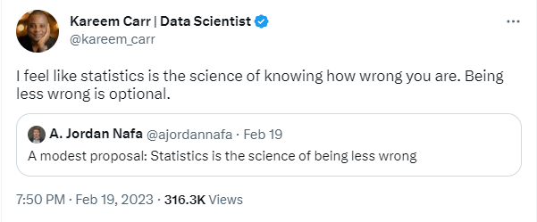

# 432 Class 11: 2023-02-21

[Main Website](https://thomaselove.github.io/432-2023/) | [Calendar](https://thomaselove.github.io/432-2023/calendar.html) | [Syllabus](https://thomaselove.github.io/432-syllabus-2023/) | [Notes](https://thomaselove.github.io/432-notes/) | [Contact Us](https://thomaselove.github.io/432-2023/contact.html) | [Canvas](https://canvas.case.edu) | [Data and Code](https://github.com/THOMASELOVE/432-data) | [Sources](https://github.com/THOMASELOVE/432-classes-2023/tree/main/sources)
:-----------: | :--------------: | :----------: | :---------: | :-------------: | :-----------: | :------------: |:------:
for everything | for deadlines | expectations | from Dr. Love | ways to get help | lab submission | for downloads | to read

## Today's Slides

Class | Date | PDF | Quarto .qmd | Recording
:---: | :--------: | :------: | :------: | :-------------:
11 | 2023-02-21 | **[Slides 11](https://github.com/THOMASELOVE/432-slides-2023/blob/main/slides11.pdf)** | **[Code 11](https://github.com/THOMASELOVE/432-slides-2023/blob/main/slides11.qmd)** | Visit [Canvas](https://canvas.case.edu/), select **Zoom** and **Cloud Recordings**

 [Link to Tweet](https://twitter.com/kareem_carr/status/1627470659793068032)

## Announcements

1. Update on Project A Plans
2. Link to Minute Paper
3. Thanks regarding How To Be a Modern Scientist first discussion on Campuswire, which is now closed.

## What Should I Be Working On?

1. Minute Paper After Class 11 is due Wednesday 2023-02-22 at Noon.
2. Quiz 1 is coming to you on Thursday 2023-02-23 by 5 PM. It is due Monday 2023-02-27 at 9 PM.
3. Project A Plans - version 2 (for many people) was due Tuesday at 9 AM. Once Dr. Love responds (via Canvas) please do as he asks. Most of you who need to do a version 3 will have a deadline for that of 9 AM Saturday 2023-02-25.

## One Last Thing

From [On the 12th Day of Christmas, a Statistician Sent to Me...](https://www.bmj.com/content/379/bmj-2022-072883)

